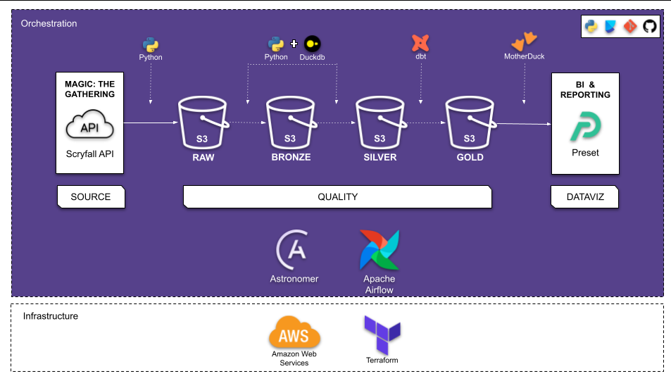
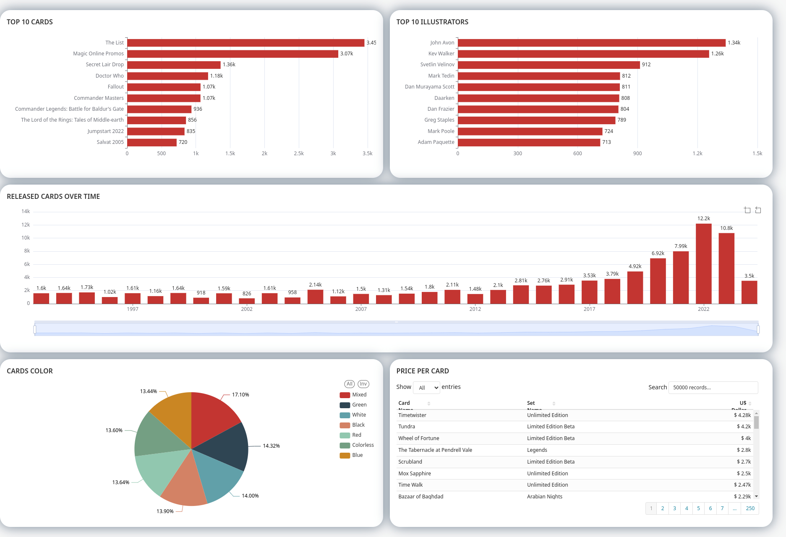

## Magic: The Gathering Data Pipeline - A Data Engineering Project
---

### About the Game

**Magic: The Gathering** (colloquially known as **Magic** or **MTG**) is a tabletop and digital collectible card game created by Richard Garfield. Released in 1993 by Wizards of the Coast, Magic was the first trading card game and had approximately fifty million players as of February 2023. Over twenty billion Magic cards were produced in the period from 2008 to 2016, during which time it grew in popularity. As of the 2022 fiscal year, Magic generates over $1 billion in revenue annually - [Wikipedia](https://en.wikipedia.org/wiki/Magic:_The_Gathering)

The goal of this project is to build an end-to-end batch data pipeline on Magic: The Gathering Data available at [Scryfall](https://scryfall.com/). In addition, perform ELT (Extract Load Transform) daily in order to analyze the cards information availabe from historical data to till date. 

### Table of contents

- [Problem statement](#problem-statement)
  - [Dataset](#dataset)
  - [Proposed Solution](#proposed-solution)
- [Data Pipeline Overview](#data-pipeline-overview)
- [Technologies](#technologies)
- [Architecture](#architecture)
- [ELT Steps](#elt-steps)
- [The Dashboard](#the-dashboard)
- [Reproduction](#reproduction)
- [Conclusion](#conclusion)

## Problem statement
---
* ### ***Data***: 
    The Data selected for this project is the `Magic: The Gathering` obtained from [Scryfall](https://scryfall.com/). This data includes the latest cards information available. Data since 1993. The Data is extracted via Scryfall API.

    The columns in the Datasets and their descriptions is available [here](docs/info_dataset.md)

* ### ***Proposed Solution***:
    This project aims at extracting this data from the source via API and building a BATCH ELT which will be scheduled to run daily and update the connected Dashboard for daily Analytics & Reporting. 

## Data Pipeline Overview 
---
This is a Batch Pipeline which will perform ELT on the every day at 09:00 am. 

The ELT steps include:

* **Extract** dataset from Scryfall via API and load the data into the Datalake
* **Clean** data and load the data into Datalake 
* **Load** the data from Datalake into external tables in the Datawarehouse
* **Transform** the data in the Datawarehouse
* **Visualize** the data by creating a Dashboard

## Data Pipeline with Medallion Architecture
---
* **RAW:** where the raw data is placed as soon as it is collected
* **BRONZE:** data treated and ready to be consumed
* **SILVER:** data processed and can be consumed easily
* **GOLD:** data made available from analyzes and models, which can be consumed by BI or DataViz tools

## Technologies 
---
* Cloud: ***AWS***
* Infrastructure as code (IaC): ***Terraform***
* Workflow orchestration: ***Astronomer + Airflow***
* Data Warehouse: ***MotherDuck***
* Batch processing: ***DuckDb***
* Data Transformation: ***dbt-core***
* DataViz: ***Preset***
* Virtual Environment: ***Poetry***
* CICD: ***Git***

## Architecture
---
Pipeline

## ELT Steps

Steps in the ELT are as follows:

1. A Project is created on ***GitHub*** 
2. Infrastructure for the Project is created using ***Terraform*** which creates the following:
    * Datalake: ***S3 Bucket*** where the raw and cleaned data will be stored
3. The Pipeline for ELT is created and is scheduled for daily execution. It is orchestrated via ***Astronomer + Airflow***, which does the following tasks:
    * Extracts raw data from source via ***Scryfall API***
    * Loads raw data as json file to ***S3 Bucket***
    * Cleans the raw data using ***DuckDb***
    * Loads the cleaned data as parquet files to ***S3***
    * Creates External table in the Datasets in ***MotherDuck*** by pulling data from ***S3***. 
    * Transforms Data from ***S3*** using ***dbt-core*** and creates the following in the dev/prod Dataset (along with Tests and Documentation)
        - The view: `stg_cards`
        - The fact table: `fact_cards`
4. Transformed Data from ***MotherDuck*** is used for Reporting and Visualization using ***Preset*** to produce Dashboards

## The Dashboard: 
---

## Conclusion
---
Through this project we were able to successfully build a ELT pipeline end to end which is scheduled to run daily. And as a result we have a daily updated **MTG cards** which can be visualized via the Dashboard on **Preset**. This helps us get some useful insights on the latest cards information.

[Back To Top](magic-the-gathering-data-pipeline-a-data-engineering-project)
